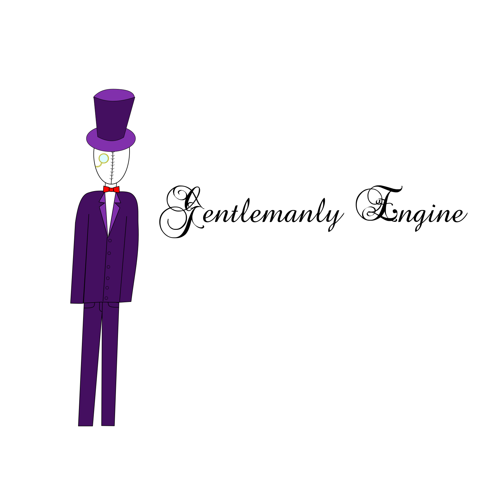

[](https://travis-ci.org/gentlemans/gentlemanly_engine)

[](https://trello.com/b/PyLZzMbi/gentlemanly-engine)

A super standard C++ game engine

#Abstract
The gentlemanly_engine is meant to provide a easy to learn, standard, well documented, extensible object-oriented 2D game engine written purely in C++ with possible python bindings later.

##Open source
We make sure to make this library totally free--and that's free as in freedom and not just free beer. We license under the MIT license, and we make sure that all of your dependencies are MIT compatible libraries, so feel free to go out there and make millions on our hundreds of hours of free work ;).

##High-level to low-level control
Want to just get started quickly and get some `actor`s on the screen? No problem, gentlemanly_engine is for you. Want physics? No problem, just add a `physics` object to the actors you want to have physics. But what if you want to write custom shaders, dig under the hood? No problem, make an actor an override the `render` method. 

##Modern C++
Written entirely in modern C++, we use modern strategies like `std::shared_ptr`, `auto`, move semantics, etc to make the developing experience better.

##No large confusing hierarchies
We use the unix philosophy here and thing that each component should do one thing and do it well, so all of the classes are very simple but together they fit to make a well-oiled machine.

##Use of preexisting libraries
We don't think that you should ever have to reinvent the wheel, so we use lots of defaco standard libraries, like GLM for vectors, Box2D for physics, Boost for everything, JsonCpp for json, etc.

##Multiple windowing backends
SDL is a very popular window backend for games, but it can be a real pain when trying to make an editor, where a GUI toolkit like Qt will fit your needs much better. There is no `window` class, just a concept that you can use. We have supplied window backends for Qt and SDL. Example:
```C++
#include <ge/appliction.hpp>
#include <ge/window_backend/sdl.hpp>

int main(int argc, char** argv)
{
	ge::application<ge::window_backend::sdl> app{argc, argv};

	auto window = app.window_backend.make_window(
		"Hello",     // title
		{},          // starting position
		{1280, 720}, // size
		false,       // fullscreen
		true         // decorated
	);

	app.execute();
}
``` 

That's all there is to it to open a window. Want a Qt window instead? Just use `ge::window_backend::qt` instead of `ge::window_backend::sdl`. That `window` object you have received will be subclassed off `QMainWindow`, so start building the widgets off that. 


##Extensible, powerful asset system
It is totally impractical to load all you assets (textures, models, animations, etc) by hand by hard-coding paths in your source code. The idea is `asset` classes create primitives like `shader`, `material`, `model`, etc using the asset system. 

###How it works
First, you define search paths by calling `app.asset_manager.add_asset_path` until you have covered all the places you would like `gentlemanly_engine` to search for assets. Classes are then registered with the `asset_manager` to be able to load an asset. Each type of asset has a unique ID; for example the `material_asset` class that loads `material`s has the ID of `material`. 


When you request the asset system to load an asset, it starts to look through the asset directories for a directory with the name of the asset. When it has found this, it looks for an `asset.json` file. This holds all of the metadata for the asset, but the only required field is `asset_type`, which tells the asset system which class to use to parse the file and create objects based on that. For example, an `asset.json` for a model might look like this:
```JSON
{
	"asset_type": "model",
	"obj_data": "model.obj"
}
```
Keep in mind: this is all decentralized and you can easily and you are encouraged to make you own assets. 
